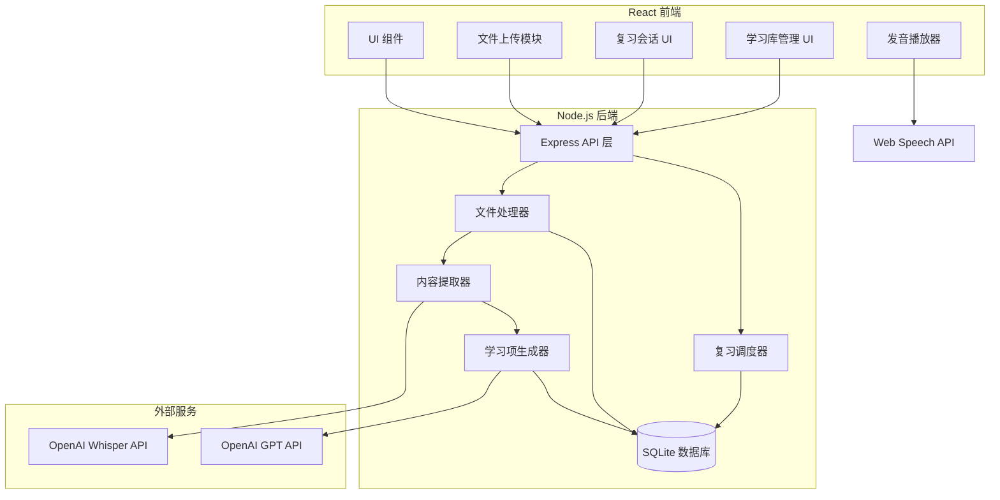
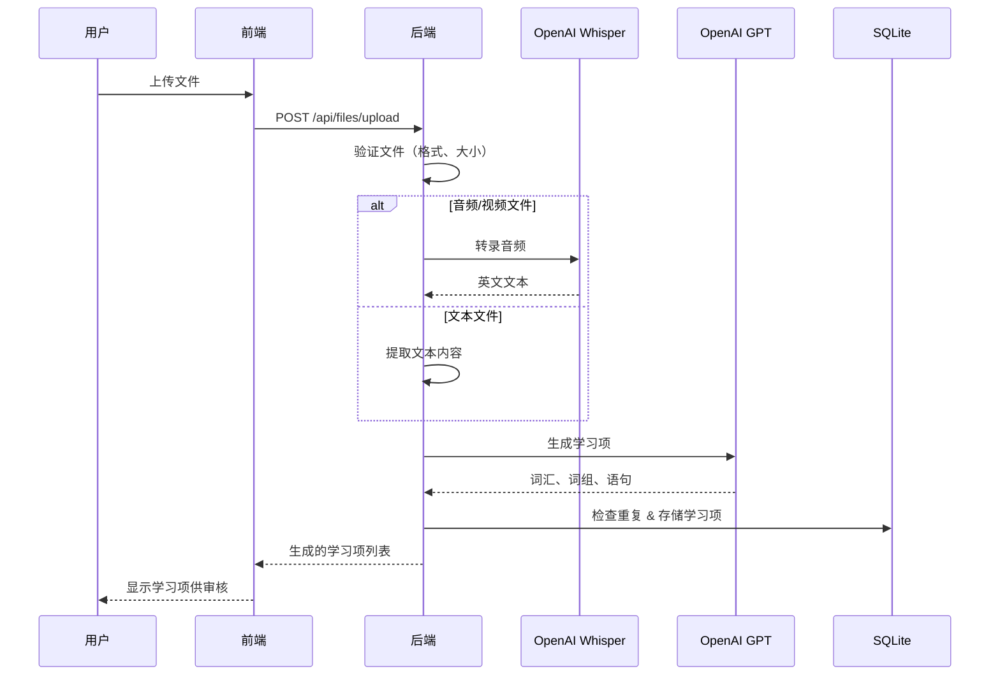
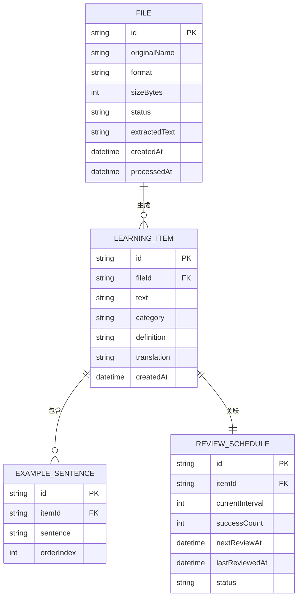

# 技术设计文档：英语学习应用

## 概述

本文档描述了一个英语学习 Web 应用的技术设计。该应用支持用户导入多模态文件（文本、视频、音频），自动提取并生成词汇/词组/语句，并使用艾宾浩斯间隔重复法配合发音播放进行学习。

应用采用客户端-服务端架构，前端使用 React，后端使用 Node.js/Express。AI 服务（OpenAI Whisper 用于转录，GPT 用于内容生成）处理核心计算，前端负责交互式学习体验。

### 关键设计决策

1. **React + TypeScript 前端** — 类型安全、组件可复用、生态丰富，适合构建交互式学习 UI。
2. **Node.js/Express 后端** — 处理文件处理、API 编排和数据持久化。
3. **OpenAI Whisper API 语音转文字** — 跨口音和噪声条件下准确率高，$0.006/分钟，支持 MP3、WAV、MP4、WEBM 格式。
4. **OpenAI GPT API 内容生成** — 提取词汇、词组、语句并附带释义和例句。
5. **Web Speech API (SpeechSynthesis) 发音播放** — 免费无 API 费用，支持美式和英式英语语音，加载后可离线使用。
6. **SQLite + Prisma ORM** — 轻量级文件数据库，适合单用户学习应用，无需外部数据库服务器。
7. **确定性艾宾浩斯间隔** — 固定间隔（1、2、4、7、15、30 天），如需求所述，简单可预测。

## 架构



### 数据流



## 组件与接口

### 前端组件

#### 文件上传组件（FileUploadComponent）
- 拖拽上传区域，带文件类型验证
- 上传和处理期间的进度指示器
- 被拒绝文件的错误显示
- 支持格式：TXT、PDF、DOCX、SRT、MP3、WAV、M4A、MP4、WEBM、MKV

#### 复习会话组件（ReviewSessionComponent）
- 卡片式显示，展示学习项文本
- 显示答案按钮，展示释义/翻译
- "记住了" / "忘记了" 响应按钮
- 进度指示器（如 "3 / 15"）
- 完成时的会话总结

#### 学习库组件（LearningLibraryComponent）
- 分页表格（每页 50 项），含类别、掌握程度、下次复习日期
- 筛选控件：类别下拉框、掌握程度下拉框
- 搜索输入框，实时筛选
- 删除确认对话框

#### 发音播放组件（PronunciationPlayerComponent）
- 播放按钮，带美式/英式英语切换
- 使用 Web Speech API SpeechSynthesis
- 重试逻辑（最多 3 次），每次超时 10 秒

### 后端 API 接口

| 接口 | 方法 | 描述 |
|------|------|------|
| `/api/files/upload` | POST | 上传并处理文件 |
| `/api/files/:id/status` | GET | 获取处理状态 |
| `/api/items` | GET | 获取学习项列表（分页、可筛选） |
| `/api/items/:id` | DELETE | 删除学习项 |
| `/api/items/batch` | POST | 批量添加生成的学习项到学习库 |
| `/api/review/due` | GET | 获取到期学习项数量和列表 |
| `/api/review/session` | POST | 开始复习会话 |
| `/api/review/respond` | POST | 提交记住/忘记响应 |
| `/api/stats` | GET | 获取学习统计数据 |

### 后端模块

#### 文件处理器（FileProcessor）
```typescript
interface FileProcessor {
  validateFile(file: UploadedFile): ValidationResult;
  processFile(fileId: string): Promise<ProcessingResult>;
}

interface ValidationResult {
  valid: boolean;
  error?: string; // "unsupported_format" | "file_too_large" | "empty_file"
}

interface ProcessingResult {
  success: boolean;
  extractedText?: string;
  error?: string;
}
```

#### 内容提取器（ContentExtractor）
```typescript
interface ContentExtractor {
  extractFromText(filePath: string, format: TextFormat): Promise<string>;
  extractFromAudio(filePath: string): Promise<string>;
  extractFromVideo(filePath: string): Promise<string>;
}

type TextFormat = 'txt' | 'pdf' | 'docx' | 'srt';
```

#### 学习项生成器（ItemGenerator）
```typescript
interface ItemGenerator {
  generateItems(text: string): Promise<LearningItem[]>;
}

interface LearningItem {
  id: string;
  text: string;
  category: 'vocabulary' | 'phrase' | 'sentence';
  definition: string;        // 英文释义
  translation: string;       // 中文翻译
  exampleSentences: string[]; // 1-3 个例句（词汇和词组）
  createdAt: Date;
}
```

#### 复习调度器（ReviewScheduler）
```typescript
interface ReviewScheduler {
  scheduleFirstReview(itemId: string): void;
  advanceToNextInterval(itemId: string): void;
  resetToFirstInterval(itemId: string): void;
  getDueItems(): Promise<LearningItem[]>;
  getDueCount(): Promise<number>;
}

// 艾宾浩斯复习间隔（天）
const REVIEW_INTERVALS = [1, 2, 4, 7, 15, 30];
```

## 数据模型

### 实体关系图



### 数据库 Schema

```sql
CREATE TABLE files (
    id TEXT PRIMARY KEY,
    original_name TEXT NOT NULL,
    format TEXT NOT NULL,
    size_bytes INTEGER NOT NULL,
    status TEXT NOT NULL DEFAULT 'pending', -- pending（待处理）, processing（处理中）, completed（已完成）, failed（失败）
    extracted_text TEXT,
    error_message TEXT,
    created_at DATETIME DEFAULT CURRENT_TIMESTAMP,
    processed_at DATETIME
);

CREATE TABLE learning_items (
    id TEXT PRIMARY KEY,
    file_id TEXT REFERENCES files(id),
    text TEXT NOT NULL,
    category TEXT NOT NULL CHECK(category IN ('vocabulary', 'phrase', 'sentence')),
    definition TEXT NOT NULL,
    translation TEXT NOT NULL,
    created_at DATETIME DEFAULT CURRENT_TIMESTAMP
);

CREATE TABLE example_sentences (
    id TEXT PRIMARY KEY,
    item_id TEXT NOT NULL REFERENCES learning_items(id) ON DELETE CASCADE,
    sentence TEXT NOT NULL,
    order_index INTEGER NOT NULL
);

CREATE TABLE review_schedules (
    id TEXT PRIMARY KEY,
    item_id TEXT NOT NULL UNIQUE REFERENCES learning_items(id) ON DELETE CASCADE,
    current_interval INTEGER NOT NULL DEFAULT 0, -- REVIEW_INTERVALS 数组的索引
    success_count INTEGER NOT NULL DEFAULT 0,
    next_review_at DATETIME NOT NULL,
    last_reviewed_at DATETIME,
    status TEXT NOT NULL DEFAULT 'active' CHECK(status IN ('active', 'mastered'))
);

CREATE INDEX idx_learning_items_text_category ON learning_items(text, category);
CREATE INDEX idx_review_schedules_next_review ON review_schedules(next_review_at);
CREATE INDEX idx_review_schedules_status ON review_schedules(status);
```

### 关键数据约束

- `learning_items.text` + `learning_items.category` 必须唯一（不区分大小写），用于重复检测
- `review_schedules.current_interval` 范围为 0 到 5（`[1, 2, 4, 7, 15, 30]` 的索引）
- `review_schedules.success_count` 范围为 0 到 6（6 次时标记为已掌握）
- `review_schedules.status` 状态转换：`active`（学习中）→ `mastered`（已掌握），单向
- 每次文件导入最多生成 200 个学习项
- 每次复习会话最多 50 个学习项
- 学习库每页最多 50 个学习项

## 正确性属性

*属性是系统在所有有效执行中应保持为真的特征或行为——本质上是关于系统应该做什么的形式化声明。属性是人类可读规范与机器可验证正确性保证之间的桥梁。*

### 属性 1：文件格式验证正确

*对于任意*文件名，文件验证器应当且仅当其扩展名（不区分大小写）属于集合 {txt, pdf, docx, srt, mp3, wav, m4a, mp4, webm, mkv} 时接受该文件，否则拒绝并返回适当的错误信息。

**验证需求：1.4, 1.5**

### 属性 2：英文内容提取排除非英文文本

*对于任意*包含英文和非英文混合段落的文本输入，内容提取器应返回仅包含英文文本段落且不包含任何非英文段落的输出。

**验证需求：2.1**

### 属性 3：生成的学习项满足有效性约束

*对于任意*提取的文本内容，学习项生成器的输出应满足：(a) 总项目数 ≤ 200，(b) 每个项目的类别属于 {vocabulary, phrase, sentence}，(c) 每个项目有非空的释义和翻译，(d) 每个词汇或词组项目有 1 到 3 个例句。

**验证需求：3.1, 3.2, 3.3**

### 属性 4：重复检测不区分大小写

*对于任意*文本为 T、类别为 C 的学习项，如果学习库中已存在文本与 T 不区分大小写匹配且类别相同为 C 的项目，则学习项生成器应跳过该重复项，学习库大小保持不变。

**验证需求：3.4**

### 属性 5：首次复习在 24 小时内安排

*对于任意*在时间 T 添加到学习库的学习项，复习调度器应将 next_review_at 设置为 (T, T + 24小时] 范围内的值。

**验证需求：4.1**

### 属性 6：标记"记住了"推进到正确的下一个间隔

*对于任意*处于间隔索引 i（其中 0 ≤ i < 5）、在时间 T 复习的学习项，标记为"记住了"应将 current_interval 设为 i+1，success_count 加 1，next_review_at 设为 T + REVIEW_INTERVALS[i+1] 天。

**验证需求：4.2, 4.3**

### 属性 7：标记"忘记了"重置到第一个间隔

*对于任意*处于任意间隔索引 i（其中 0 ≤ i ≤ 5）、在时间 T 复习的学习项，标记为"忘记了"应将 current_interval 重置为 0，success_count 重置为 0，next_review_at 设为 T + 1 天。

**验证需求：4.4**

### 属性 8：到期学习项判定

*对于任意*状态为 "active" 且 next_review_at ≤ 当前时间的学习项，该项应出现在到期列表中。对于 next_review_at > 当前时间或状态为 "mastered" 的项目，不应出现在到期列表中。

**验证需求：4.5, 4.8**

### 属性 9：复习会话遵守最大数量限制

*对于任意* N 个到期学习项的集合，开始复习会话应包含恰好 min(N, 50) 个项目。

**验证需求：4.7**

### 属性 10：6 次成功复习后转为已掌握

*对于任意* success_count = 5 且处于间隔索引 5 的学习项，标记为"记住了"应将其状态转换为 "mastered"，该项不再出现在到期列表中。

**验证需求：4.9**

### 属性 11：会话总结计数准确

*对于任意*包含一系列"记住了"和"忘记了"响应的已完成复习会话，会话总结应报告 remembered_count + forgotten_count = 总复习项数，且每个计数应与实际对应响应数量匹配。

**验证需求：5.5**

### 属性 12：会话进度显示正确

*对于任意*包含 N 个总项目、当前位置为 i（从 1 开始）的活跃复习会话，进度显示应为 "i / N"。

**验证需求：5.6**

### 属性 13：部分完成的会话保留已复习项并保持未复习项为到期状态

*对于任意*包含 N 个项目的复习会话，用户在复习 k 个项目后退出（k < N），已复习的 k 个项目应保存其响应（间隔已更新），剩余的 N-k 个项目应保持到期状态。

**验证需求：5.7**

### 属性 14：发音重试不超过 3 次

*对于任意*学习项的发音播放失败序列，发音播放器应最多允许 3 次重试，之后显示"暂时不可用"信息。

**验证需求：6.5**

### 属性 15：分页每页不超过 50 项

*对于任意*包含 N 个项目的学习库，每页应包含最多 50 个项目，总页数应等于 ceil(N / 50)。

**验证需求：7.1**

### 属性 16：类别筛选仅返回匹配项

*对于任意*类别筛选值 F ∈ {vocabulary, phrase, sentence} 应用于学习库，结果集中的每个项目应有 category = F，且没有 category = F 的项目被排除在结果之外。

**验证需求：7.2**

### 属性 17：掌握程度分类正确

*对于任意* success_count 为 S 的学习项，掌握程度应为：S = 0 时为"新学"，1 ≤ S ≤ 5 时为"学习中"，S ≥ 6 时为"已掌握"。按掌握程度筛选应返回恰好匹配该分类的项目。

**验证需求：7.3**

### 属性 18：搜索筛选返回正确的子串匹配

*对于任意*长度 ≥ 1 的搜索查询 Q 应用于学习库，结果集中的每个项目应在 text、definition 或 translation 中至少一个字段包含 Q 作为不区分大小写的子串。包含 Q 的项目不应被排除。

**验证需求：7.4**

### 属性 19：统计计数准确

*对于任意*学习库状态，统计应报告：total_items = 所有项目数，items_mastered = 状态为 "mastered" 的项目数，items_due = 状态为 "active" 且 next_review_at ≤ 当前时间的项目数。

**验证需求：7.7**

## 错误处理

### 文件上传错误

| 错误条件 | 响应 | 用户操作 |
|---------|------|---------|
| 不支持的格式 | 显示支持的格式列表 | 使用正确格式重新上传 |
| 文件 > 500MB | 显示最大大小提示 | 压缩或拆分文件 |
| 空文件（0 字节） | 显示"无内容"提示 | 上传非空文件 |
| 处理超时（300秒） | 显示超时提示 | 重试上传 |
| 上传期间网络故障 | 显示连接错误 | 重试上传 |

### 内容提取错误

| 错误条件 | 响应 | 用户操作 |
|---------|------|---------|
| 提取失败 | 显示失败原因 + 文件类型 | 尝试其他文件 |
| 提取超时（120秒） | 显示超时提示 | 尝试更短的内容 |
| 未找到英文内容 | 显示"无英文内容"提示 | 上传英文内容 |
| Whisper API 不可用 | 显示服务错误 | 稍后重试 |

### 学习项生成错误

| 错误条件 | 响应 | 用户操作 |
|---------|------|---------|
| 生成失败 | 显示失败原因 | 重试或尝试其他内容 |
| 未生成任何项目 | 显示"无项目"提示 | 上传更丰富的内容 |
| GPT API 不可用 | 显示服务错误 | 稍后重试 |

### 复习会话错误

| 错误条件 | 响应 | 用户操作 |
|---------|------|---------|
| 无到期项目 | 显示"全部完成"提示 | 稍后再来 |
| 会话保存失败 | 显示错误，保留本地状态 | 重试保存 |

### 发音错误

| 错误条件 | 响应 | 用户操作 |
|---------|------|---------|
| 音频加载超时（10秒） | 显示错误 + 重试按钮 | 点击重试（最多 3 次） |
| 所有重试已用尽 | 显示"暂时不可用"提示 | 跳过发音 |
| 语音不可用 | 回退到默认语音 | 无需操作 |

### 通用错误处理策略

1. **优雅降级** — 如果非关键功能失败（如发音），应用其余部分继续正常工作。
2. **用户友好的提示** — 所有错误信息使用通俗语言，而非技术术语。
3. **重试机制** — 临时性故障（网络、API）提供重试选项。
4. **状态保留** — 复习会话中出错时，已提交的响应会被保留。
5. **超时保护** — 所有异步操作都有超时设置，防止无限等待。

## 测试策略

### 基于属性的测试（Property-Based Testing）

本功能非常适合基于属性的测试，因为包含大量纯逻辑：
- 文件验证（格式检查）
- 间隔重复调度（间隔计算）
- 重复检测（字符串匹配）
- 筛选和搜索（集合操作）
- 分页（算术运算）
- 统计计算（聚合）

**测试库**：[fast-check](https://github.com/dubzzz/fast-check)（TypeScript/JavaScript PBT 库）

**配置**：
- 每个属性测试最少 100 次迭代
- 每个测试标记为：`Feature: english-learning-app, Property {编号}: {属性描述}`

**需实现的属性测试**（每个正确性属性对应一个测试）：
1. 文件格式验证（属性 1）
2. 英文内容提取（属性 2）
3. 生成项有效性（属性 3）
4. 重复检测（属性 4）
5. 首次复习调度（属性 5）
6. 记住推进间隔（属性 6）
7. 忘记重置间隔（属性 7）
8. 到期项判定（属性 8）
9. 会话大小限制（属性 9）
10. 掌握状态转换（属性 10）
11. 会话总结准确性（属性 11）
12. 进度显示（属性 12）
13. 部分会话持久化（属性 13）
14. 重试限制（属性 14）
15. 分页（属性 15）
16. 类别筛选（属性 16）
17. 掌握程度分类（属性 17）
18. 搜索筛选（属性 18）
19. 统计准确性（属性 19）

### 单元测试（基于示例）

关注特定场景和边界情况：
- 恰好 500MB 的文件上传（边界值）
- 空文件拒绝
- 恰好 300 秒的处理超时
- 视频字幕提取及回退
- 恰好 50 个到期项的复习会话
- 级联删除（学习项 + 复习计划 + 例句）
- 发音语音选择（美式/英式默认值）

### 集成测试

- 文件上传 → 提取 → 生成 完整流程（端到端）
- OpenAI Whisper API 转录示例音频
- OpenAI GPT API 生成示例文本的学习项
- Web Speech API 发音播放
- Prisma 数据库 CRUD 操作

### 测试目录结构

```
tests/
├── unit/
│   ├── fileValidator.test.ts
│   ├── reviewScheduler.test.ts
│   ├── itemGenerator.test.ts
│   ├── libraryFilter.test.ts
│   └── sessionManager.test.ts
├── property/
│   ├── fileValidation.property.ts
│   ├── reviewScheduler.property.ts
│   ├── duplicateDetection.property.ts
│   ├── libraryOperations.property.ts
│   └── sessionManagement.property.ts
└── integration/
    ├── fileProcessing.integration.ts
    ├── whisperApi.integration.ts
    └── database.integration.ts
```
